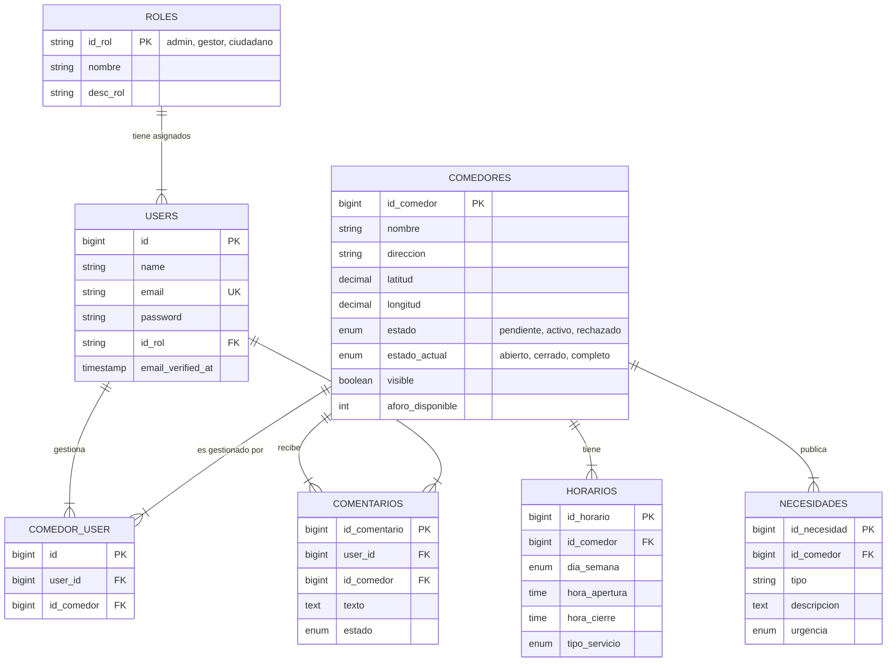

# Diagrama Entidad-Relación

Este diagrama representa la estructura de base de datos actual implementada en el Sprint 3.

## Relaciones Clave

1.  **Gestión de Comedores (N:M)**: Implementada a través de la tabla pivote `comedor_user`. Un usuario (Gestor) puede administrar múltiples comedores, y un comedor podría tener múltiples gestores.
2.  **Roles (1:N)**: Cada usuario tiene un único rol asignado desde la tabla `roles`.
3.  **Dependencias Fuertes (1:N)**: Horarios, Necesidades y Comentarios dependen directamente de un comedor (eliminación en cascada).
