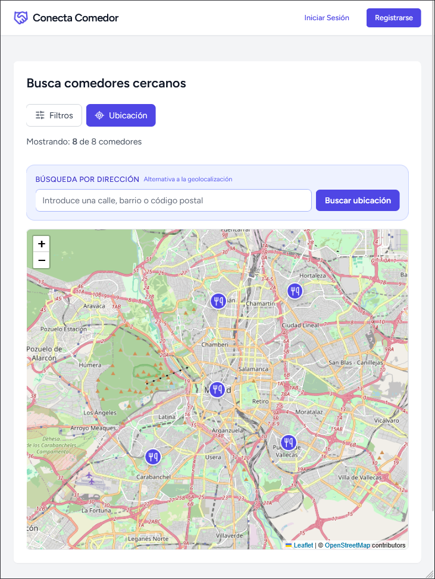
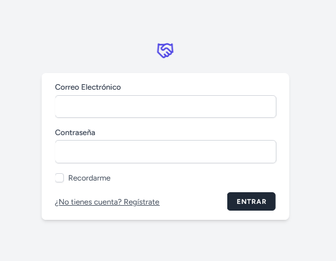
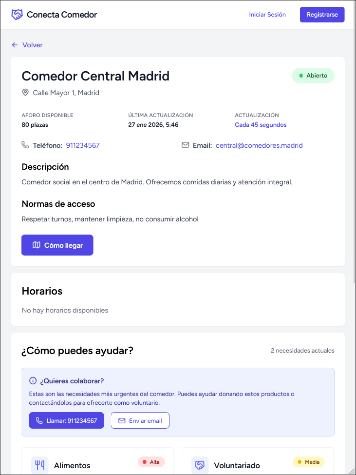
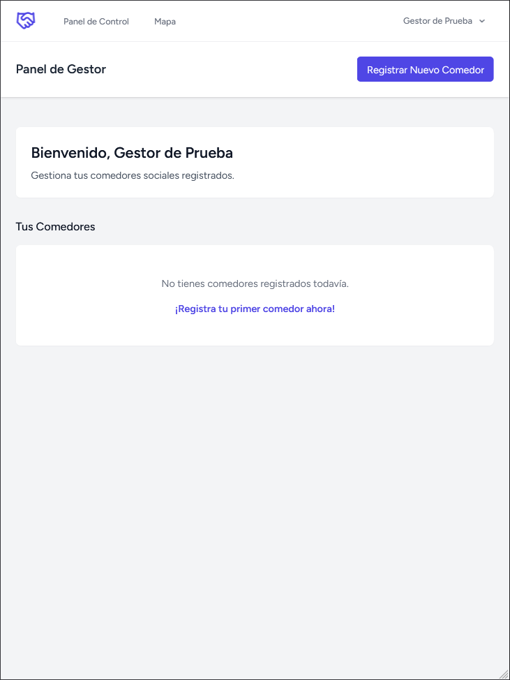
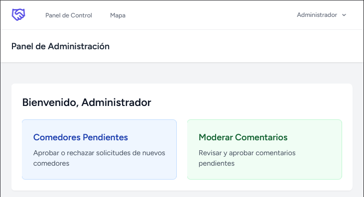
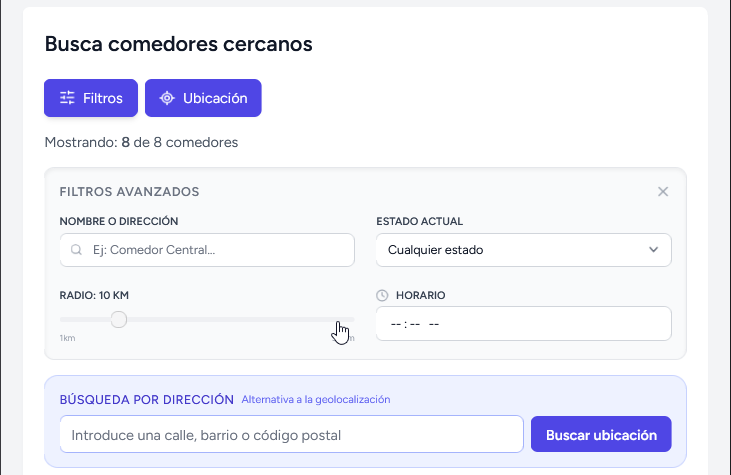

# Manual de Usuario - Conecta Comedor

Bienvenido al manual de usuario de **Conecta Comedor**, la plataforma para la gestión y localización de comedores sociales.

## 1. Acceso y Registro

### 1.1. Página Principal y Mapa Público
Cualquier usuario puede acceder a la página principal para ver el mapa de comedores.

- **URL de Acceso**: [https://conecta-comedor.mariocm.dev](https://conecta-comedor.mariocm.dev) (Producción) o `http://localhost:8000` (Local).
- **Mapa Interactivo**: Muestra marcadores con la ubicación de comedores activos.
- **Filtros**: Usa el botón "Filtros" para buscar por cercanía, estado (abierto/cerrado) o nombre.

### 1.2. Registro e Inicio de Sesión
Para acceder a funciones avanzadas, debes tener una cuenta.

1. Haz clic en **"Registrarse"** en la barra superior.
2. Rellena el formulario con tus datos.
3. Automáticamente se te asignará el rol de **Ciudadano**.

Si ya tienes cuenta, pulsa **"Iniciar Sesión"**.

## 2. Perfiles de Usuario

### 2.1. Ciudadano
- **Funciones**:
  - Buscar comedores en el mapa.
  - Ver fichas detalladas con horarios y necesidades.
  - Enviar comentarios y valoraciones.
  - Gestionar su perfil personal.

### 2.2. Gestor de Comedor
Usuarios encargados de mantener la información de sus centros.

- **Panel de Control (Dashboard)**:
  - Vista resumen de los comedores asignados.
  - Estado actual del comedor (Abierto/Cerrado/Completo).
- **Gestión de Comedores**:
  - **Editar Información**: Actualizar dirección, teléfono y descripción.
  - **Horarios**: Definir horas de apertura y cierre por día.
  - **Necesidades**: Publicar listas de necesidades urgentes (ej: "Aceite", "Voluntarios").
  - **Solicitar Nuevo Comedor**: Formulario para dar de alta un nuevo centro.

### 2.3. Administrador
Responsables globales de la plataforma.

- **Moderación de Comedores**:
  - Validar nuevas solicitudes de alta de comedores.
  - Aprobar o rechazar cambios.
- **Moderación de Comentarios**:
  - Revisar comentarios reportados o pendientes de aprobación.

## 3. Funcionalidades Clave

### 3.1. Búsqueda y Filtrado
En el mapa, puedes:
- **Geolocalización**: Pulsa el botón "Ubicación" para centrar el mapa en tu posición.
- **Búsqueda por Dirección**: Escribe una calle o barrio para mover el mapa allí.
- **Ver Lista**: Despliega el panel lateral para ver los resultados en formato lista.

